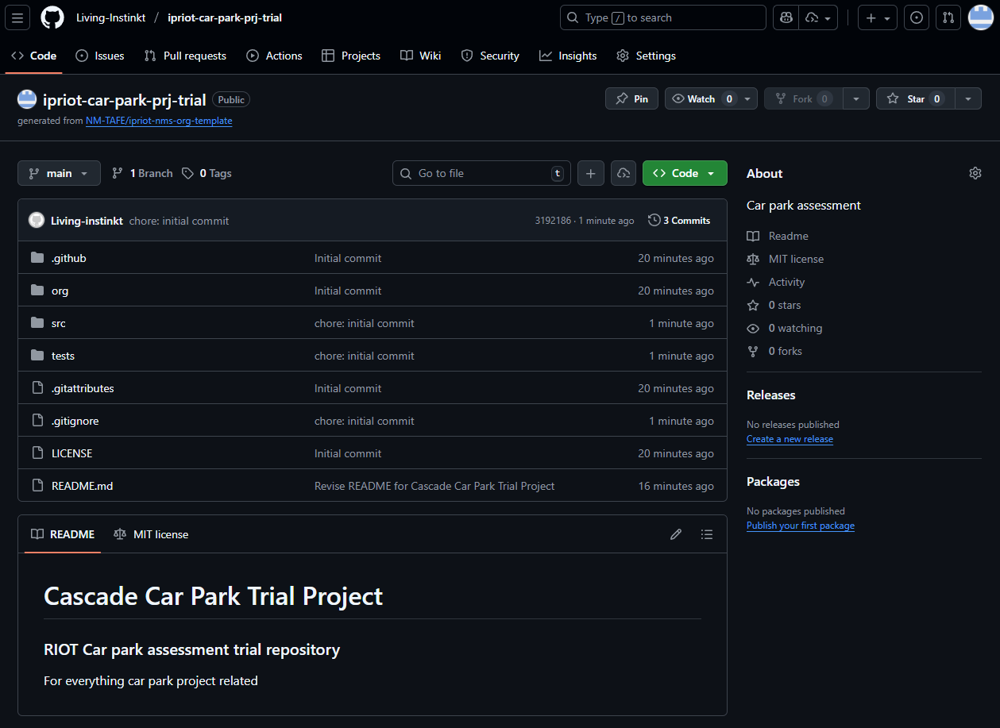

# Cascade Car Park Trial Project

### RIOT Car park assessment trial repository 
For everything car park project related
___

### Evidence
#### 2.1. Set up version control

 

#### 2.3 Identify classes, methods, and attributes
| Class Name | Attributes                                  | Methods                           |
|------------|---------------------------------------------|-----------------------------------|
| CarPark    | location, number_plates, capacity, displays | init, add_car, remove_car         |
| Sensor     | car_park_id, is_active                      | init, read_plate, update_car_park |
| Display    | car_park_id, message, is_on                 | init, str                         |

 

#### 2.4. Implement stubs for the classes

___